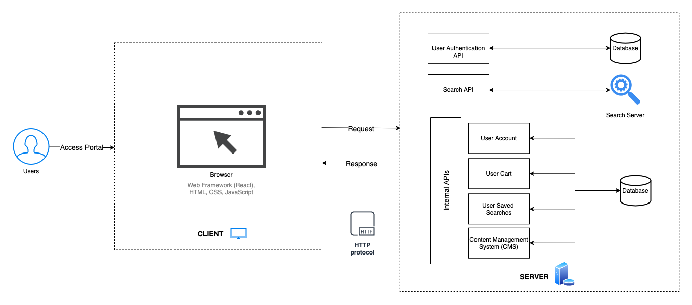

# Architecture Design

This page provides a high-level overview of the project architecture.

## Overview

The project repo is a mono-repo split up between directories for the `frontend/`, `backend/`, and `traefik/`. Although both sides of the stack are in a single repo, each directory contains its own microservices.

**Why a mono-repo?**

- Only client for the MetaGrid API back-end is the MetaGrid front-end
- Simplifies end-to-end development and testing -- ship code faster!
- Effective end-to-end code reviews
- Easy refactoring
- Reduced code complexity with standardizations across services

Source: [http://blog.shippable.com/our-journey-to-microservices-and-a-mono-repository](http://blog.shippable.com/our-journey-to-microservices-and-a-mono-repository)

### Simple Architecture Diagram

## Scaffolding

In root, there are several directories that contain microservices:

- `frontend/`
- `backend/`
- `traefik/`
- `docs/`

### Front-end

The user interface is rendered through React components which allow for modular and reusable design patterns.

To communicate with REST APIs, the front-end uses a promise-based HTTP client. Aside from the MetaGrid API back-end, here are other ESGF services used:

- [ESGF `Search` API](https://github.com/ESGF/esgf.github.io/wiki/ESGF_Search_REST_API) - This API is the interface connected to the search engine (Solr, Elastic Search)
- [ESGF `wget` API](https://github.com/esgf/esgf-wget) - This API generates wget scripts for downloading datasets

### Back-end

MetaGrid's Django REST Framework back-end serves REST APIs, which send and receive JSON data via endpoints.

### Traefik

Traefik is a modern HTTP reverse proxy and load balancer that makes deploying microservices easy. Traefik is used in the production deployment of MetaGrid.

### Docs

Stores document related files for the entire project using Markdown and MkDocs.
