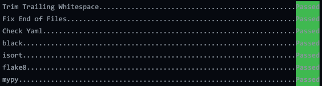

# Getting Started for Local Development

!!! note

    If you're new to Docker or Podman, please be aware that some resources (volumes, networks) are cached system-wide
    and might reappear if you generate a project multiple times with the same name (e.g.
    this issue with Postgres `<docker-postgres-auth-failed>`). This applies to both Docker and Podman.

## Prerequisites

- Container Runtime:
  - [Docker](https://docs.docker.com/get-docker/) with [docker-compose](https://docs.docker.com/compose/install/), **OR**
  - [Podman](https://podman.io/getting-started/installation) with the [compose plugin](https://github.com/docker/compose) or [podman-compose](https://github.com/containers/podman-compose)
- Python >= 3.8 to create virtual environment for `pre-commit` package

### Using Podman Instead of Docker

Metagrid fully supports [Podman](https://podman.io/) as a drop-in replacement for Docker. Podman is a daemonless container engine that's compatible with Docker commands and can be used rootless for improved security.

#### Installing Podman

**macOS:**
```bash
brew install podman
podman machine init
podman machine start
```

**Linux:**
```bash
# Fedora/RHEL/CentOS
sudo dnf install podman podman-compose

# Ubuntu/Debian
sudo apt-get install podman podman-compose
```

**Windows:**
Follow the [official Podman installation guide](https://podman.io/getting-started/installation#windows).

#### Compose Plugin Setup

Podman supports Docker Compose through either:

1. **podman-compose** (recommended for RHEL/production):
   ```bash
   # Install with pip
   pip3 install --user podman-compose
   
   # Verify it's working
   podman-compose --version
   ```

2. **Podman Compose plugin** (alternative):
   ```bash
   # Verify it's working
   podman compose version
   
   # If not available on RHEL 9+
   sudo dnf install podman-plugins
   ```

The `manage_metagrid.sh` script automatically detects whether Docker or Podman is available and uses the appropriate command. It prioritizes `podman-compose` when available to avoid socket-related issues.

#### Rootless Podman (Recommended)

Run Podman in rootless mode (without sudo) for better security:
```bash
# Test rootless mode works
podman ps

# If you get permission errors, ensure podman-compose is installed
pip3 install --user podman-compose
```

**Avoid running with sudo** - rootful Podman can cause networking issues where the browser cannot connect to services.

## 1. Clone your fork and keep in sync with upstream `master`

```bash
git clone https://github.com/<your-github-username>/metagrid.git
```

Rebase your fork with upstream to keep in sync

```bash
# Add the remote, call it "upstream":
git remote add upstream https://github.com/aims-group/metagrid.git

# Fetch all the branches of that remote into remote-tracking branches
git fetch upstream

# Make sure that you're on your master branch:
git checkout master

# Rewrite your master branch so that any of your commits that
# aren't already in upstream/master are replayed on top of the
# other branch:
git rebase upstream/master
git push -f origin master
```

Checkout a new branch from `master`.

```bash
git checkout -b <branch-name> master
```

## 2. Set up `pre-commit`

This repo has default integration with [pre-commit](https://pre-commit.com/), a tool for identifying simple issues before submission to code review. These checks are performed for all staged files using `git commit` before they are committed to a branch.

### 2.1 Integrated Hooks (Quality Assurance Tools)

| Platform              | Code Formatter                                   | Linter                                           | Type Checker                  |
| --------------------- | ------------------------------------------------ | ------------------------------------------------ | ----------------------------- |
| Python                | [black](https://black.readthedocs.io/en/stable/) | [flake8](https://github.com/PyCQA/flake8#flake8) | [mypy](http://mypy-lang.org/) |
| JavaScript/TypeScript | [prettier](https://prettier.io/)                 | [ESLint](https://eslint.org/)                    | N/A                           |

### 2.2 Install

```bash

# Create a python3 virtual environment using system-level Python.
# There may be alternative ways for you to do this.
python3 -m venv backend/venv

# Activate the virtual environment
source backend/venv/bin/activate

# Install local requirements
pip install -r requirements/local.txt

# Install pre-commit hooks
pre-commit install
```

**Note: any update to `.pre-commit.config.yml` requires a reinstallation of the hooks**

### 2.3 Helpful Commands

Manually run all pre-commit hooks

```bash
pre-commit run --all-files.
```



Run individual hook

```bash
# Available hook ids: trailing-whitespace, end-of-file-fixer, check-yaml, black, isort, flake8, mypy
pre-commit run <hook_id>.
```

## 3. Set up Back-end

### 3.1 Build and Run the Stack

This can take a while, especially the first time you run this particular command on your development system but subsequent runs will occur quickly.

**Using the management script (recommended):**
```bash
./manage_metagrid.sh
# Select option 3 for "Start / Stop Local Dev Containers"
```

**Manual command (Docker):**
```bash
docker compose up --build
```

**Manual command (Podman):**
```bash
podman compose up --build
```

The `manage_metagrid.sh` script automatically detects your container runtime (Docker or Podman) and uses the appropriate commands.

### 3.2 Additional Configuration

#### Update `/etc/hosts` file

The backend Django service can be accessed by other containers over a shared network using its docker service name and port, `django:5000`. More information on how this works can be found in Docker's [networking guide](https://docs.docker.com/compose/networking/).

You will need to bind the hostname `django` to `localhost` to allow the browser to make requests to the backend Django service. Otherwise, it will not recognize the hostname and a network connection won't be established.

1. Open your hosts file with admin privileges
   1. Mac/Linux: `/etc/hosts`
   2. Windows: `C:\Windows\System32\drivers\etc\hosts`
2. Append `127.0.0.1 django` to the end of the file and save

#### Create user on Keycloak for authentication

This user will be used for logging into registered Keycloak clients, including the React and Django services.

1. Head over to <http://localhost:1337>
2. Login with admin credentials (automatically created)
   - username: admin
   - password: admin
3. Follow the official Keycloak instructions to [create a new user](https://www.keycloak.org/docs/latest/getting_started/#creating-a-user)

### 3.3 Accessible Services

- Frontend: <http://localhost:9443>
- Keycloak: <http://localhost:1337>
- Docs: <http://localhost:8001>

### 3.4 Troubleshooting

#### Addressing Keycloak Boot Issue

Keycloak has a known fatal issue where if it is interrupted during boot (stopping `docker compose up` prematurely), the command that adds the admin user fails.

As a result, the Keycloak docker service will not start and outputs the error **_"User with username 'admin' already..."_**.

If you run into this problem, follow these workaround steps:

1. Stop all back-end containers

      docker compose down

2. Comment out the two relevant lines in `docker-compose.yml`:

   - `#KEYCLOAK_USER: admin`
   - `#KEYCLOAK_PASSWORD: admin`

3. Rebuild and restart the containers

      docker compose up --build

4. Un-do commenting
   - `KEYCLOAK_USER: admin`
   - `KEYCLOAK_PASSWORD: admin`

Source:

- [https://issues.redhat.com/browse/KEYCLOAK-12896](https://issues.redhat.com/browse/KEYCLOAK-12896)
- [https://stackoverflow.com/a/59712689/8023435](https://stackoverflow.com/a/59712689/8023435)

## 4. Set up Front-end

### 4.1 Build and Run the Stack

This can take a while, especially the first time you run this particular command on your development system but subsequent runs will occur quickly.

**Using the management script (recommended):**
```bash
./manage_metagrid.sh
# Select option 3 for "Start / Stop Local Dev Containers"
```

**Manual command:**
```bash
# Docker
docker compose up --build

# Podman
podman compose up --build
```

### 4.2 Accessible Services

- React: `localhost:9443`

---

## VSCode Configuration

`.vscode/settings.json` files are provided to automatically configure your VSCode to leverage the quality assurance tools even if you use workspaces or open the folder directly.

## Third Party Tool Integration

Code coverage: [](https://codecov.io/gh/aims-group/metagrid/)

Dependency Monitoring: [](https://renovatebot.com/) [](https://pyup.io/repos/github/aims-group/metagrid/)

Docs: [](https://metagrid.readthedocs.io/en/latest/?badge=latest)
