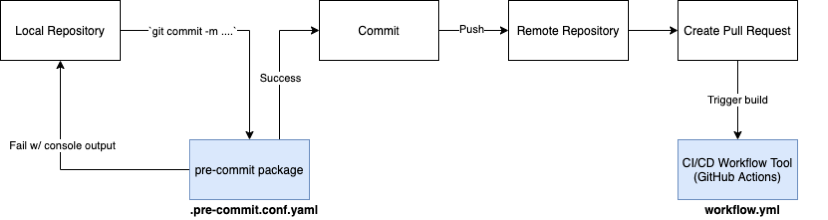

# Project Standards

This page outlines version control, styling and formatting, documenting, and testing.

## Version Control

The repository uses **GitHub Flow**, a lightweight, branch-based workflow that supports teams and projects where deployments are made regularly.
GitHub Flow aligns with **continuous delivery** of modern web applications where changes are not rolled back and multiple versions of software does not need to be supported.

### GitHub Flow in a Nutshell

1. `master` must always be deployable
2. All changes are made through **support** branches on forks. Reference [list below](#type-of-support-branches)
3. Rebase with master to avoid/resolve conflicts
4. Make sure `pre-commit` checks pass when committing
5. Open a pull-request (PR) and follow the PR guidelines
6. Once the PR's build passes and is approved, **squash and rebase** your commits
7. Merge in to `master` and **delete the branch**

Source: [https://guides.github.com/introduction/flow/](https://guides.github.com/introduction/flow/)

### Branching

#### Types of Support Branches

- `feature/` branches used to develop new features
  - The essence of a feature branch is that it exists as long as the feature is in development, but will eventually be merged back into master.
- `hotfix/` branches arise from the necessity to act immediately upon an undesired state of a live production version
  - When a critical bug in a production version must be resolved immediately, a hotfix branch may be branched off from the master branch.

Source: [https://nvie.com/posts/a-successful-git-branching-model/#supporting-branches](https://nvie.com/posts/a-successful-git-branching-model/#supporting-branches)

#### Branch Naming Convention

Make sure to reference the issue number related to the branch, along with a clear description (use your issue title for reference).

- `feature/181-add-user-auth`
- `hotfix/67-searches-not-saving`

### Squash and Rebase Commits

Before you merge a support branch back into `master`, your support branch should be squashed down to a single buildable commit, and then rebased from the up-to-date `master` branch.

Why?

- Ensures build passes from the commit
- Cleans up Git history for easy navigation
- Makes collaboration process more efficient
- Makes handling conflicts from rebasing simple since you only have to deal with conflicted commits

Source: [https://blog.carbonfive.com/always-squash-and-rebase-your-git-commits/](https://blog.carbonfive.com/always-squash-and-rebase-your-git-commits/)

### Pre-commit

The repository uses the `pre-commit` package to manage pre-commit hooks for the quality assurance tools.
These hooks help enforce software standards and identify simple issues at the commit level before submitting code reviews.

#### Quality Assurance Tools

| Platform  | Code Formatter                                   | Linter                                           | Type Checker                  |
| --------- | ------------------------------------------------ | ------------------------------------------------ | ----------------------------- |
| Back-end  | [black](https://black.readthedocs.io/en/stable/) | [flake8](https://github.com/PyCQA/flake8#flake8) | [mypy](http://mypy-lang.org/) |
| Front-end | [prettier](https://prettier.io/)                 | [ESLint + Airbnb](https://eslint.org/)           | TypeScript (language)         |

---

##### Ways to Run Tools

1. Using `pre-commit` - recommend in most cases, commands found [here](../getting_started_local#helpful-commands)
2. Using IDE/text editor - recommended alongside #1 for integrated linting and formatting, only VSCode `settings.json` file provided for configuration
3. Using terminal to run standalone tool - useful to test configs. Visit the tool's site for a list of commands

### Summary

#### DOs for Version Control

- **DO** keep `master` in working order
- **DO** learn to rebase
- **DO** fork the repository
- **DO** squash commits
- **DO** open PRs early for discussion
- **DO** pull in (rebase on top of) changes
- **DO** name your branches clearly against an issue number

#### DON'Ts for Version Control

- **DON'T** merge in broken or commented out code
- **DON'T** commit onto `master` directly
- **DON'T** rebase `master`
- **DON'T** merge with conflicts. Handle conflicts upon rebasing

Source: [https://gist.github.com/jbenet/ee6c9ac48068889b0912](https://gist.github.com/jbenet/ee6c9ac48068889b0912)

## Documenting APIs

Code should be self-documenting. However, when necessary, documentation should explain **WHY** something is done, its purpose, and its goal. The code already shows **HOW** it is done, so commenting on this can be redundant.

### DOs for Documenting

- **DO** embrace documentation as an integral part of the overall development process
- **DO** treat documenting as code and follow principles such as _Don't Repeat Yourself_ (DRY), _Easier to Change_ (ETC)
- **DO** use comments and docstrings to explain ambigiuity, complexity, or to avoid confusion
- **DO** co-locate documentation with related code -- makes maintenance simpler
- **DO** use type annotations and type comments (for Python)

### DON'Ts for Documenting

- **DON'T** write comments as a crutch for poor code
- **DON'T** comment _every_ function, data structure, type declaration, etc. -- two things need to be updated when you make a single update

Source: “A Pragmatic Philosophy.” _The Pragmatic Programmer: Your Journey to Mastery_, by David Thomas and Andrew Hunt, Pearson Education, Inc., 2020, pp. 23–23.

## Testing and Continuous Integration (CI)

MetaGrid uses GitHub Actions to run the workflows below:

1. Back-end CI - runs formatters, linters, and a `pytest` test suite and uploads coverage report

2. Front-end CI - runs formatters, linters, and `jest`/`react-testing-library` test suite and uploads a coverage report

### How do I Know What to Test?

Use code coverage tools to generate a report and see what you should test. Be aware, code coverage tools measure lines of code covered by tests. **You should still write test cases that exceed the base testcases**.

The repository's code coverage tools have minimum threshold percentages for code coverage. If your PR's CI build causes the code coverage percentage to drop below the limit, **your build cannot be merged**.
